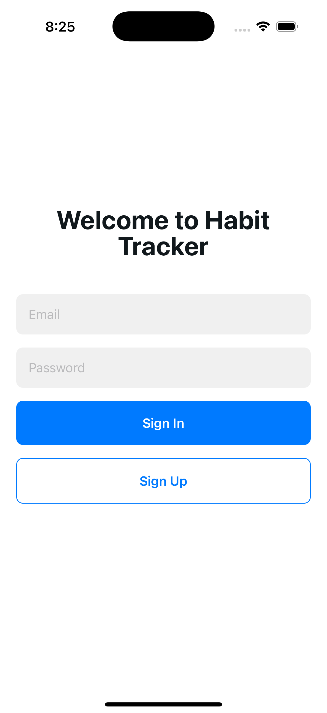
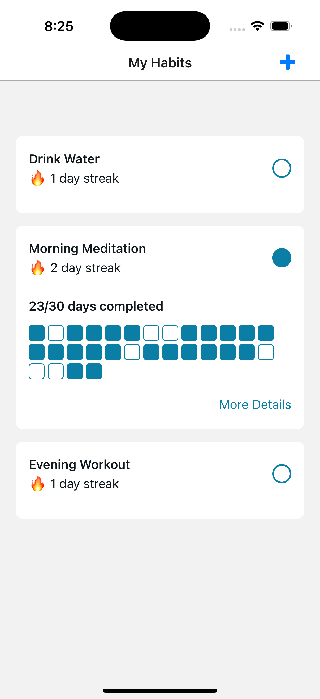
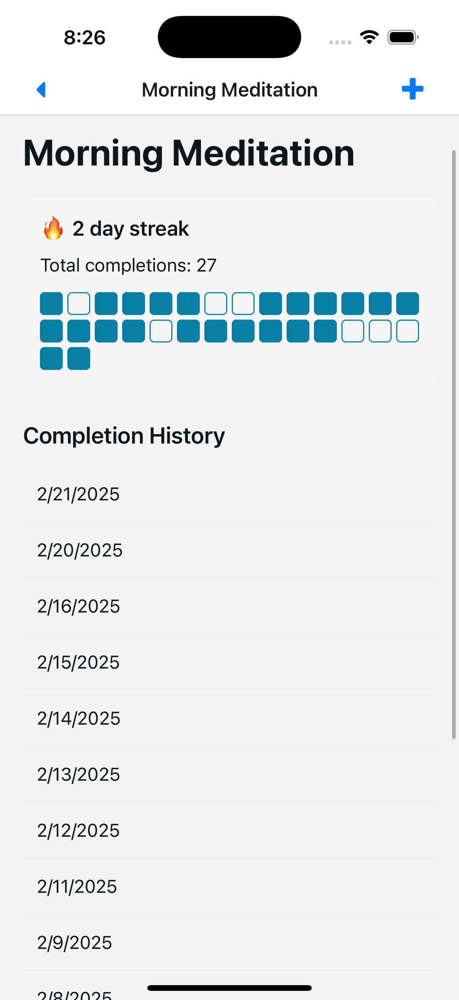

# Zakk's Habit Tracker

A very simple habit tracking app. Create habits and track them daily. Earn a streak by tracking a habit for multiple days in a row. This project was built as an experiment with Cursor in a new domain for me (mobile). While I was able to vibe code most of the app with Cursor, I still ended up writing and organizing a lot of the code myself.

Two interesting things that came out of this project:

1. I experimented with using Cursor's [new rules feature](#cursor-rules), both for managing tasks (below) and for even writing rules.

2. I used Cursor to do some [project management](#project-management) and very light product management. This helped both of us stay focused and acted as a set of guard rails on Cursor.

  
  
  
  

## Tech Stack
- React Native
- Expo
- Typescript
- Supabase

## Cursor Rules

I used this as a project to experiment with the cursor rules outlined in [this article](https://ghuntley.com/stdlib/). The format worked really well and, in particular, the [rule to write rules](./.cursor/rules/cursor-rules.mdc). I worked with the composer and this rule to write the project management rule that I'll explain below.

## Project Management

One theory I'm testing is that the repository for the codebase will become the repository for the codebase and all context about that codebase. Documentation and tests are now great forms of context, but we can leverage more by integrating other working files into the codebase itself. Some immediate examples that are high-leverage are: product requirement docs, product and technical specs, and any other engineering or product documents.

With Cursor rolling out an MCP server integration, maybe we wont end up with these things as part of the codebase. But Cursor seems to benefit from having things "at hand" or close by in a way that maybe MCP servers wont be able to accomplish.

In this project, I found that having Cursor manage the tasks to be really beneficial - both write the task descriptions and then writing code against those descriptions. The tasks look a lot like tickets in an agile project management system. Here are some examples:

- [fix-routing](./project/tasks/fix-routing.md)
- [habit-detail-view](./project/tasks/habit-detail-view.md)
- [see-habit-streak](./project/tasks//see-habit-streak.md)

You'll see these are pretty high level and really writen for humans, not LLMs. There is probably a lot of efficienty to gain by making these more tailored to LLMs.

## Next steps and some loose thoughts

Next, I'd like to experiment by pushing more of the context around the codebase and the project into a format that Cursor and Claude can use. I've always found product management to be so heavy-handed (I've worked as a technical PM in the past!), but having PRDs to guide the LLM could be really helpful. A suite of PM tools that resolve to flat markdown files in the codebase could become really useful. THat is, unless MCP servers for product management apps get good enough and Cursor gets good enough at included that data in context. In either case, being able to coach Claude with a bunch of context on (a) the sprint and (b) the task at hand (so, a sort of global and local context) could help a lot. 

Finally, there's probably a lot of efficiency to be gained by leveraging LLMs in the PM process to produce more specificity. Instead of ~3-5 page doc describing the sprint and a set of ~0.5-1 page tickets describing each task, the PM side of the house can use LLMs to produce:

- A ~3-5 page summary of the sprint for humans coupled with a ~100 page description of the current state of the codebase and what needs to change where
- A ~0.5 page ticket with additional context like, a description of the diff that needs to happen to the app, pseudocode for the changes that need to be made, etc

I do wonder how this would scale across a really large product or codebase. If a team of ~100 devs was working on a project, now you're in a world where there are many teams touching many different parts of the product and you're dealing with a codebase that can't fit into context windows at their current size. At that point, I think you need ways of providing the code for the feature or part of the product that you're working on with summaries of the other parts of the product.